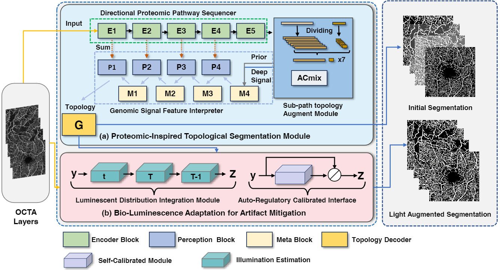
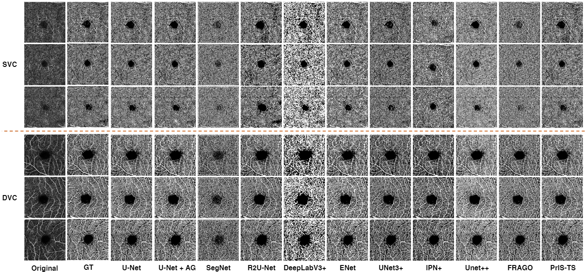
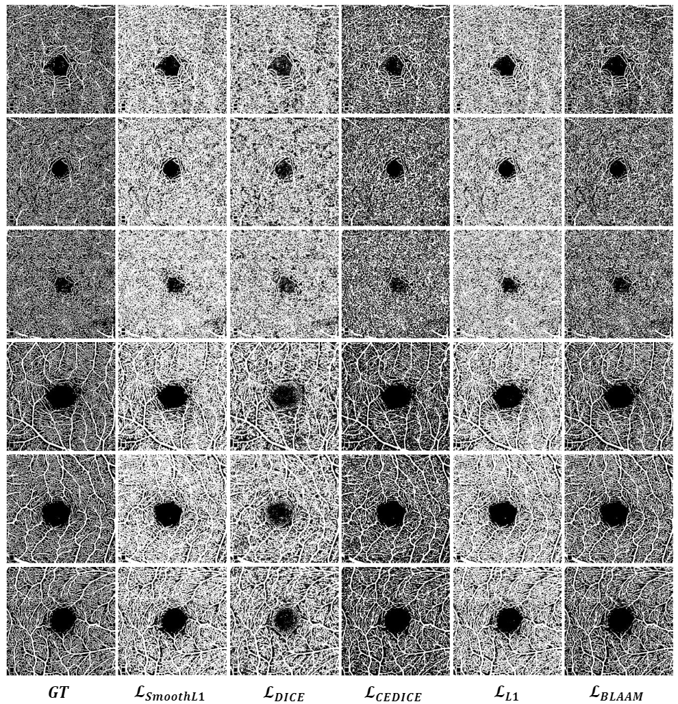

# BiSTIM

<a href="https://colab.research.google.com/drive/1QwAbn5hsdqKOD5niuBzuqQX4eLCbNKFL?usp=sharing"></a>

This repository is the official PyTorch implementation of Low-light OCTA Images Segmentation Under the Constraints of Vascular Network Topology.


 :rocket:  :rocket:  :rocket: **News**:

2023/10/27: We released the source code

Introduction
-----------------
Optical Coherence Tomography Angiography (OCTA) provides unprecedented insights into the retinal vascular system. However, precise segmentation of OCTA images poses formidable challenges. Current methods contend with issues such as imaging artifacts and poor clarity under dark scene conditions that complicate the diagnosis and classification of diseases like Branch Vein Occlusion (BVO). To tackle these obstacles, we have developed a network based on topological structure generation that employs a transition from superficial to deep retinal layers, aiming to enhance OCTA segmentation accuracy. Both qualitative visual comparisons and quantitative metric analyses support improved performance. Moreover, our introduced enhancement methodology mitigates artifacts induced by low-light OCTA, reducing noise and improving clarity. Additionally, our system provides a structured approach to classifying BVO diseases, filling a significant gap in this domain. The overarching goal of these methods is to improve OCTA image quality and strengthen the reliability of segmentation. Preliminary assessments indicate potential for establishing robust fine-grained standards for OCTA vascular segmentation and analysis.



Quantitative comparison between on OCTA-500
-----------------



| Model      | Recall  | Specificity | Accuracy | IoU     | Dice    | Kappa   | GMEAN   |
| ---------- | ------- | ----------- | -------- | ------- | ------- | ------- | ------- |
| U-Net      | 0.75383 | 0.99016     | 0.87466  | 0.74629 | 0.85293 | 0.74474 | 0.86294 |
| U-Net + AG | 0.77178 | 0.9848      | 0.88394  | 0.75916 | 0.86178 | 0.76168 | 0.87097 |
| SegNet     | 0.81311 | 0.80561     | 0.80959  | 0.56305 | 0.7201  | 0.57808 | 0.80728 |
| R2U-Net    | 0.70778 | 0.90013     | 0.80622  | 0.6292  | 0.77141 | 0.6029  | 0.79595 |
| DeepLabv3+ | 0.66382 | 0.84648     | 0.76596  | 0.56371 | 0.71964 | 0.51783 | 0.74807 |
| ENet       | 0.79958 | 0.88435     | 0.85193  | 0.67881 | 0.80759 | 0.68453 | 0.84009 |
| UNet3+     | 0.89195 | 0.90247     | 0.90022  | 0.76309 | 0.86497 | 0.78515 | 0.8959  |
| IPN+       | 0.89606 | 0.89936     | 0.89969  | 0.76105 | 0.86364 | 0.7837  | 0.89644 |
| Unet++     | 0.77575 | 0.98719     | 0.8874   | 0.76483 | 0.86476 | 0.76878 | 0.87392 |
| FRAGO      | 0.87397 | 0.92738     | 0.90814  | 0.78399 | 0.87819 | 0.80362 | 0.89866 |
| Ours       | 0.86386 | 0.94036     | 0.91118  | 0.79581 | 0.8858  | 0.81138 | 0.91074 |


Quantitative comparison of BLAAM and other loss functions
-----------------




| Losses    | Recall  | Specificity | Accuracy | IoU     | Dice    |
| --------- | ------- | ----------- | -------- | ------- | ------- |
| Smooth_l1 | 0.44308 | 0.99987     | 0.50747  | 0.44307 | 0.61177 |
| DICE      | 0.72692 | 0.92355     | 0.82637  | 0.66887 | 0.80044 |
| 2DCE      | 0.99214 | 0.65821     | 0.67872  | 0.16068 | 0.27194 |
| CEDICE    | 0.84813 | 0.92515     | 0.89541  | 0.76264 | 0.86457 |
| focal     | 0.99638 | 0.64922     | 0.6656   | 0.12617 | 0.21917 |
| L1        | 0.75383 | 0.99016     | 0.87466  | 0.74629 | 0.85293 |
| BLAAM     | 0.86386 | 0.94036     | 0.91118  | 0.79581 | 0.8858  |


### Example conda environment setup
```bash
conda create --name bistim python=3.9 -y
conda activate bistim
conda install pytorch==1.10.0 torchvision==0.11.0 cudatoolkit=11.1 -c pytorch -c nvidia
pip install opencv-python pycocotools matplotlib onnxruntime onnx timm
```

### **Getting Started**

First download a [model checkpoint](#model-checkpoints). Then the model can be used in just a few lines to get masks from a given prompt:

```python
from models import bistim
input = torch.randn((1, 3, 512, 512))
model = bistim(num_classes=3)
out = model(input)
```

To train bistim: 
```
python train.py
```

Citation
---------------

If you find BISTimuseful in your research or refer to the provided baseline results, please star :star: this repository and consider citing :pencil:
